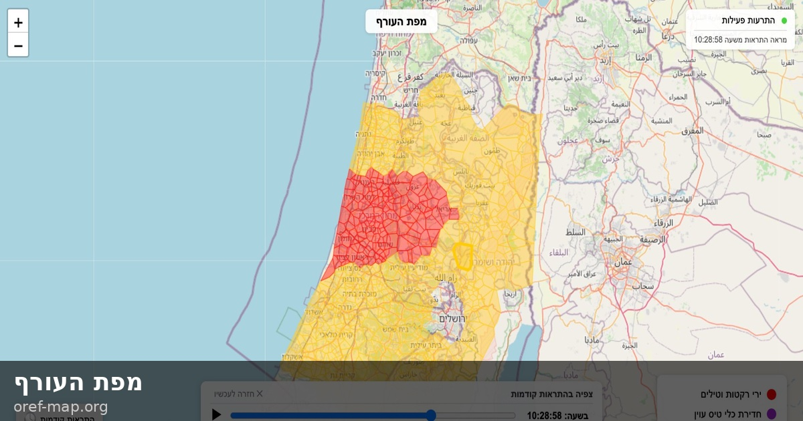

# oref-map — מפת העורף

Live map of Israel showing [Pikud HaOref](https://www.oref.org.il) (Home Front Command) alerts as colored area polygons per location.

**Live**: https://oref-map.org

<table>
  <tr>
    <td align="center"><br/>Desktop</td>
    <td align="center"><br/>Mobile</td>
  </tr>
</table>

## Features

- Colored Voronoi area polygons per location — adjacent same-colored areas merge into contiguous zones
- Timeline slider to scrub through the last ~1–2 hours of alert history
- Sound alerts — optional audio notifications for new alerts (muted by default, toggle via 🔇)
- Click any area to see its alert history
- About modal — click ⓘ or the title for info and disclaimer

| Color | Meaning |
|-------|---------|
| 🔴 Red | Rocket/missile fire |
| 🟣 Purple | Drone/aircraft infiltration |
| 🟡 Yellow | Early warning / preparedness — go near your shelter, sirens may follow |
| 🟢 Green | Event ended (fades out after 1 minute) |

## Development

```sh
./web-dev        # start dev server at http://localhost:8787
```

Requires [Node.js](https://nodejs.org) and `npx` (comes with npm). Uses [Wrangler](https://developers.cloudflare.com/workers/wrangler/) to serve `web/` and run the API proxy functions locally.

## Deploy

Deployed to [Cloudflare Pages](https://pages.cloudflare.com) (static assets + TLV proxy):

```sh
./deploy
```

The fallback Worker (for non-TLV users) is deployed separately:

```sh
cd worker && npx wrangler deploy
```

## Structure

```
web/
  index.html          # single-file map app (all JS/CSS inline)
  cities_geo.json     # location → [lat, lng] lookup
functions/
  api/
    alerts.js         # proxies live alerts API
    history.js        # proxies history API
    alarms-history.js # proxies extended history API
worker/
  src/index.js        # fallback proxy for non-TLV users (placement: azure:israelcentral)
  wrangler.toml       # Worker config with placement and /api2/* route
```

## Data

Polls the Oref APIs:

- **Live alerts** (`/api/alerts`) — every 1 second
- **History** (`/api/history`) — every 10 seconds
- **Extended history** (`/api/alarms-history`) — on demand (timeline slider)
